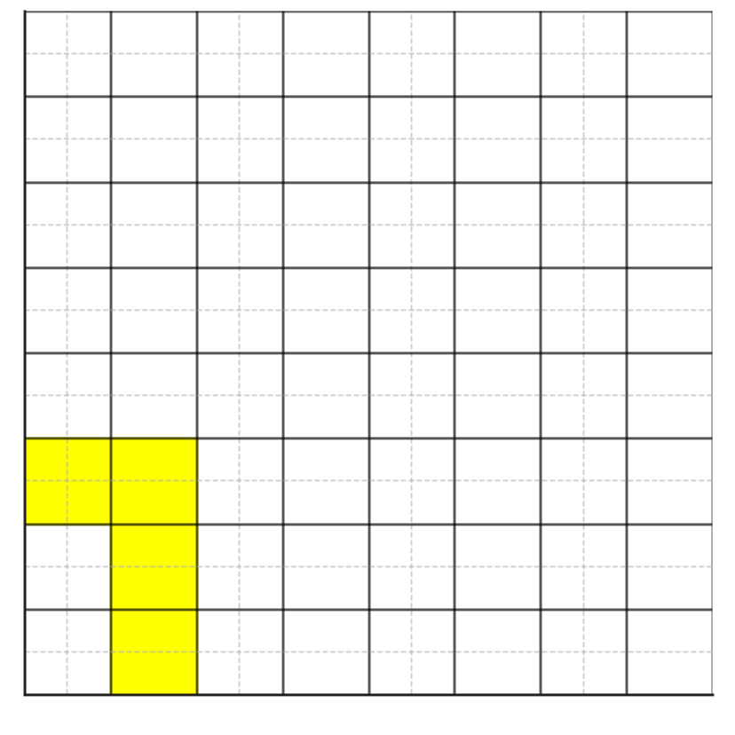
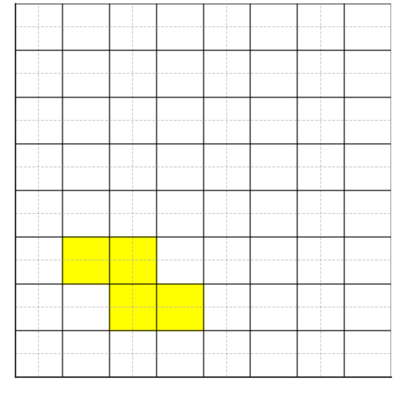
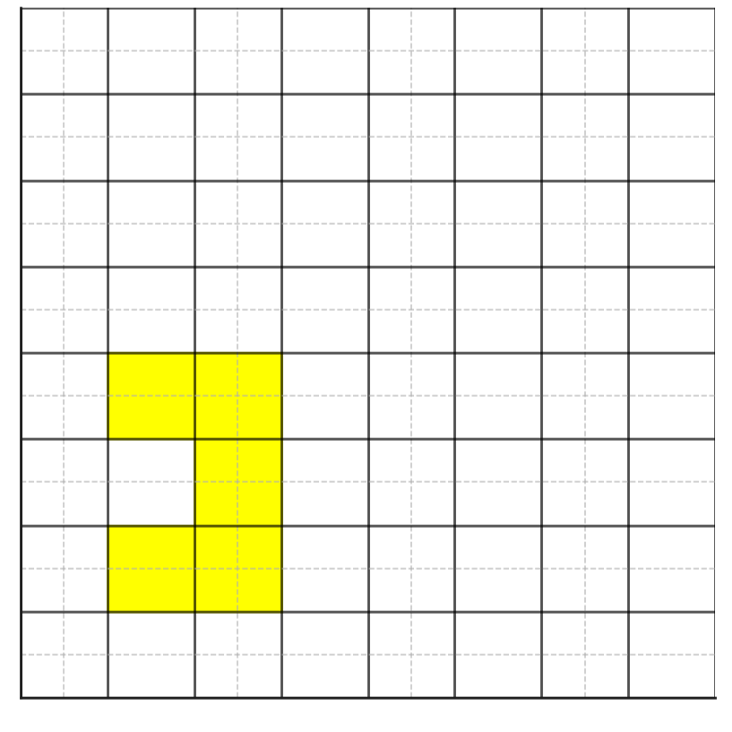

# **Application Quiz 1**

## **Question (English)**
A number within a specific range will be taken from the user, and an encryption process will be performed on a **map with user-defined dimensions**. The encryption process will follow these steps:

---

### **1. Map Generation**
- A map of **user-defined rows and columns** will be created.
- The numbers on the map will be randomly assigned **within the range specified by the user**.

---

### **2. Key Generation**
- A **random (x, y) coordinate** on the map will be selected as the **starting point**.
- The path to generate the key will be determined **using one of three predefined path templates**.
- **XOR operations will be applied** to all numbers on the selected path to generate the key.
- If the path **goes outside the map**, the modulo operation will be applied, allowing movement to the **opposite side of the map**.

---

### **3. Encryption Process**
- The number entered by the user will be **encrypted using the generated key via the XOR operation**.

---

**Example Map 1:**  

**Example Map 2:**  

**Example Map 3:**  

---

# **Uygulama Quizi 1**

## **Soru (Türkçe)**
Kullanıcıdan belirli bir sayı aralığında bir sayı alınıp, **kullanıcının belirlediği boyutlarda bir harita** üzerinde şifreleme işlemi yapılacaktır. Şifreleme işlemi aşağıdaki adımlara göre gerçekleştirilecektir:

---

### **1. Harita Üretimi**
- **Kullanıcının belirlediği satır ve sütun sayısında** bir harita oluşturulacaktır.
- Haritadaki sayılar, **kullanıcının belirlediği alt ve üst sınıra** göre rastgele atanacaktır.

---

### **2. Anahtar Üretimi**
- **Başlangıç noktası** olarak harita üzerinde rastgele bir **(x, y) koordinatı** seçilecektir.
- Anahtar oluşturulacak yol, **3 farklı hazır yol şablonundan biriyle** belirlenecektir.
- **Seçilen yol boyunca XOR işlemi uygulanarak** anahtar oluşturulacaktır.
- Yol harita dışına çıkarsa, **mod işlemi uygulanarak haritanın diğer ucuna geçilecektir**.

---

### **3. Şifreleme İşlemi**
- Kullanıcının girdiği sayı, **üretilen anahtar ile XOR işlemine tabi tutularak** şifrelenmiş hale getirilecektir.

---

**Örnek Harita 1:**  

**Örnek Harita 2:**  

**Örnek Harita 3:**  

